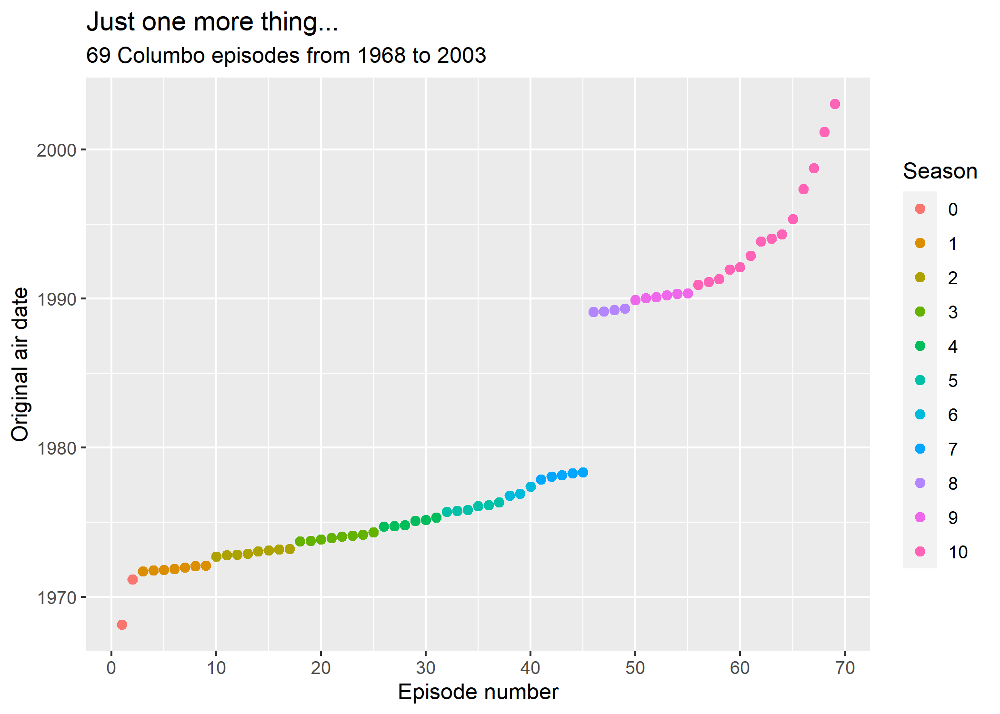

# Columbo 

A small dataset that contains information related to Columbo - the
American crime drama television series starring Peter Falk.

The data has been taken from multiple sources

-   Wikipedia <https://en.wikipedia.org/wiki/Columbo_(season_1)>
-   Mark Longair
    <https://longair.net/blog/2017/06/04/when-does-columbo-first-appear-in-each-episode/>

This work is licensed under [Attribution 4.0 International (CC BY
4.0)](https://creativecommons.org/licenses/by/4.0/)

## Data dictionary

The .csv dataset is stored in this repository as *columbo_data.csv*

-   I have tried to remove text parsing problems caused by special
    characters but some certainly still remain
-   **Warning!** The `description` field contains spoilers about the
    episodes

| column name              | description                                                                      | attribution                                |
|:-------------------------|:---------------------------------------------------------------------------------|:-------------------------------------------|
| season                   | Season 0 is for pilot episodes. Season 10 collates several episodes and specials | Wikipedia                                  |
| episode                  | Episode number (within season)                                                   | Wikipedia                                  |
| episode_index            | Episode number (over all seasons)                                                | Wikipedia                                  |
| title                    | Episode title                                                                    | Wikipedia                                  |
| directed_by              | Director                                                                         | Wikipedia                                  |
| written_by               | \(S\) = Story by (T) = Teleplay by                                               | Wikipedia                                  |
| murderer_played_by       | Actor(s) who played the murderer(s)                                              | Wikipedia                                  |
| victim_played_by         | Actor(s) who played the victims(s)                                               | Wikipedia                                  |
| original_air_date        | Episode original air date                                                        | Wikipedia                                  |
| columbo_first_appearance | Time of Columbo’s first appearance in episode (seconds)                          | Mark Longair (<https://longair.net/blog/>) |
| run_time                 | Episode run time                                                                 | Mark Longair (<https://longair.net/blog/>) |
| occupation_of_murderer   | Occupation of the murderer                                                       | Mark Longair (<https://longair.net/blog/>) |
| network                  | Broadcasting network                                                             | Wikipedia                                  |
| description              | Episode description (SPOILERS!)                                                  | Wikipedia                                  |

## A visualisation

A quick visualisation showing the two distinct time periods when
episodes of Columbo were being aired

